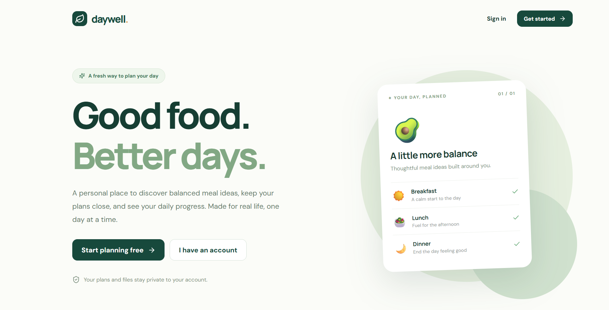
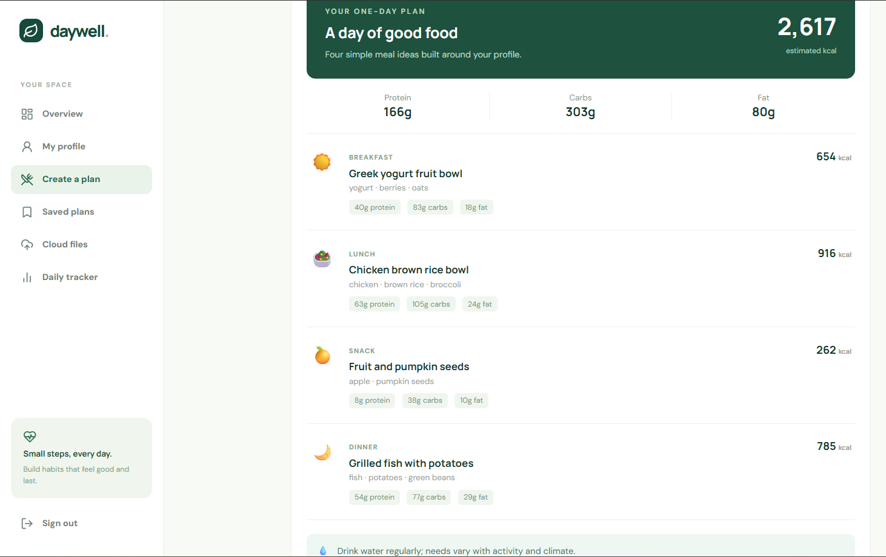
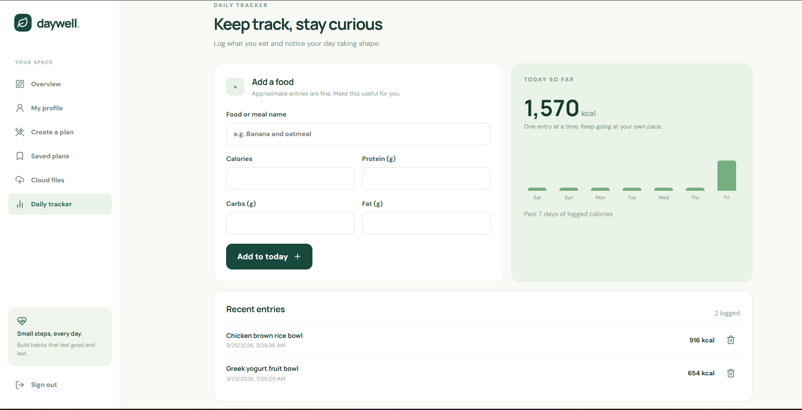

# Daywell — Personal Diet Planner

**A full-stack, cloud-ready meal-planning project for general wellness.** Daywell turns a saved profile into a one-day meal plan, lets people keep plans and private files, and tracks daily intake in a personal dashboard. It runs locally without a paid service, API key, or cloud account.



## What it does

- **Accounts and profiles:** register, sign in, and save goals, activity level, eating style, cuisines, and allergies.
- **Meal planning:** generate breakfast, lunch, a snack, and dinner with estimated calories and macronutrients. The local rule-based planner works by default; an optional AI API can be configured with validation and a rule-based fallback.
- **Plans and files:** save and export plans, and upload or download private files after an account ownership check.
- **Daily tracking:** record meals and view recent entries, a seven-day chart, and an overview of saved plans, files, and intake.
- **Project tooling:** FastAPI's interactive API documentation, automated backend tests, frontend build checks, GitHub Actions CI, and Docker Compose.

## Screenshots

These screenshots show **sample data from a local run**. The displayed plan was generated by the rule-based planner. Their filenames follow the demo sequence: landing page → generated meal plan → daily tracker → overview.

| Generated one-day plan | Daily tracker |
| --- | --- |
|  |  |


## How it works

The React/Vite frontend calls a FastAPI REST API with a bearer token. SQLAlchemy stores account, profile, plan, file metadata, and intake data. Files are kept in private local storage by default. The plan generator reads the saved profile, estimates general-wellness targets, and selects meals that match the configured preference and known allergen labels.

| Component | Local demo | Optional cloud configuration |
| --- | --- | --- |
| Web UI | React, React Router, Vite | Static frontend host |
| API and authentication | FastAPI, JWT, PBKDF2 | Container-hosted API |
| Database | SQLAlchemy with SQLite | PostgreSQL via `DATABASE_URL` |
| File storage | Private local folder | S3-compatible bucket |
| Plan generator | Rule-based recipe catalog | Compatible AI endpoint with validation and fallback |

The source contains cloud adapters and deployment instructions. **This repository does not include a live AI provider, cloud credentials, or a deployed website.** See [cloud concepts](docs/02_cloud_concepts.md) and [deployment notes](docs/08_local_and_cloud_deployment.md).

## Run locally

You need **Python 3.12 or newer**, **Node.js 22** (the CI version), and two terminals. Open `01_Personal_Diet_Planner` in VS Code. Run commands from the named folders below.

### Terminal 1: backend (Windows PowerShell)

```powershell
cd backend
python -m venv .venv
.\.venv\Scripts\python.exe -m pip install -r requirements-dev.txt
.\.venv\Scripts\python.exe -m uvicorn app.main:app --reload
```

For macOS or Linux, use `python3 -m venv .venv`, then `.venv/bin/python -m pip install -r requirements-dev.txt` and `.venv/bin/python -m uvicorn app.main:app --reload` from `backend/`.

### Terminal 2: frontend

From the project root in a second terminal:

```bash
cd frontend
npm ci
npm run dev
```

Open **http://localhost:5173**. API documentation is at **http://127.0.0.1:8000/docs**; the health endpoint is **http://127.0.0.1:8000/health**. Register with demo data, save a profile, generate and save a plan, and add sample tracker entries.

The default frontend API URL is `http://localhost:8000`. If you use a Vite URL with a different origin, add that **exact origin** to backend `CORS_ORIGINS` before starting Uvicorn. For example, in PowerShell:

```powershell
$env:CORS_ORIGINS = "http://localhost:5173,http://127.0.0.1:5173,http://YOUR-LAN-IP:5173"
.\.venv\Scripts\python.exe -m uvicorn app.main:app --reload
```

Replace `YOUR-LAN-IP` with your computer's IP address, or use `http://localhost:5173` on the same computer. If accessing from another device, also configure the frontend's `VITE_API_URL` so that device can reach the backend.

### Docker Compose (optional)

From the project root, create a root `.env` from [.env.example](.env.example), replace `SECRET_KEY` with a **random value of at least 32 characters**, then run:

```bash
docker compose up --build
```

Open **http://localhost:8080**. Docker uses a named volume for the SQLite database and private objects. `docker compose down` stops the services; `docker compose down -v` also **deletes that volume and its demo data**.

## Configuration

Local Uvicorn reads **shell environment variables**, not the root `.env` file automatically. Docker Compose reads the root `.env`. Keep real keys in environment variables or untracked local files; only commit `.env.example`.

| Setting | Local default | When to change it |
| --- | --- | --- |
| `DATABASE_URL` | `sqlite:///./diet_planner.db` | PostgreSQL connection for a managed database |
| `SECRET_KEY` | Development-only sample | Always replace for deployment; set `APP_ENV=production` |
| `STORAGE_BACKEND` | `local` | Set `s3` with bucket, endpoint/region, and credentials |
| `STORAGE_DIR` | `./data/objects` | Private local storage path |
| `AI_API_URL`, `AI_API_KEY`, `AI_MODEL` | No live AI endpoint | Optional compatible chat-completions service |
| `CORS_ORIGINS` | `http://localhost:5173` | Exact web app origins, comma-separated |
| `VITE_API_URL` | `http://localhost:8000` | Browser-accessible API origin at frontend build time |

See [.env.example](.env.example) and [frontend/.env.example](frontend/.env.example) for examples. Profile and plan data are stored in `backend/diet_planner.db` when running from `backend/`; local files go into `backend/data/objects/`. These paths are ignored by Git.

## Check the project

```bash
cd backend
python -m pytest -q
```

```bash
cd frontend
npm ci
npm run build
```

The backend suite covers account access, profile validation, dietary filters, AI fallback, saving/exporting plans, private files, and intake tracking. The [collection's CI workflow](../.github/workflows/ci.yml) runs backend tests and builds the frontend on pushes and pull requests. See the [interactive OpenAPI specification](http://127.0.0.1:8000/docs) while the backend is running for exact request and response schemas.

## Repository layout

```text
backend/app/          FastAPI, auth, planner, database, and storage adapters
backend/tests/        API and planner tests
frontend/src/         React application and styles
Screenshots/          Numbered local screenshots used above
docs/                 Cloud concepts and deployment guide
../.github/workflows/  Continuous integration for the collection
docker-compose.yml    Local container setup
```

## Boundaries

Daywell is an **educational general-wellness demo**. Recipe data, portion sizes, calories, and macronutrients are approximate. The small recipe catalog and AI validator cannot establish ingredient or medical allergy safety. The UI uses a browser-stored bearer token, and rate limiting is in memory; a production release would need further security, persistence, schema migrations, and clinical review where applicable. Optional cloud and live AI paths require credentials and independent verification before being described as deployed.
