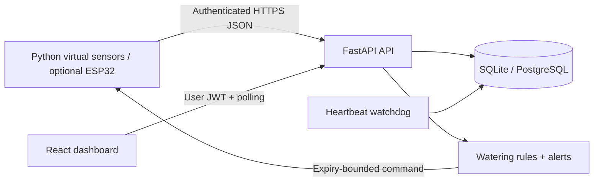

# Verdant — Cloud-Connected Smart Plant Care

**An IoT-to-cloud portfolio project that runs entirely without hardware.**

Monitor virtual plants, explore sensor history, and control bounded watering through a professional React dashboard. A Python simulator produces correlated environmental trends; FastAPI validates readings, persists them, applies watering rules, and tracks alerts.


**Status:** locally verified simulation. Cloud deployment files and PostgreSQL support are included; no hosted deployment or physical hardware validation is claimed. See [test results](reports/TEST_RESULTS.md).

## Overview and problem

Inconsistent watering and missed environmental changes make plant care difficult. Verdant combines sensor telemetry, centralized history, configurable plant rules and remote controls. The objective is to demonstrate the cloud application lifecycle while keeping the project accessible to students without sensors or pumps.

## Features

- Three seeded virtual plants; add more devices from the dashboard.
- Soil moisture, temperature, humidity, light and tank level; polling every three seconds.
- Moisture, temperature and humidity charts; watering journal and recent-window analytics.
- Automatic watering, manual commands, emergency stop and per-plant thresholds.
- Maximum 15-second command, 60-second cooldown, 45-second heartbeat timeout and low-tank lockout.
- Low-moisture, high-temperature, low-tank and offline alerts with acknowledgement and resolution.
- Owner-scoped JWT authentication; separately hashed device API keys.
- Duplicate sample detection, retries, validation, request throttling and graceful storage failures.
- SQLite local mode; PostgreSQL cloud mode using the same models.
- Docker, Render blueprint, CI, automated tests and optional ESP32 firmware.

## Architecture



Data flow: virtual plant → trend-based readings → authenticated REST API → validation/storage → automation → command response → virtual moisture recovery → dashboard. [Architecture and schema](docs/ARCHITECTURE.md)

## Technology stack

| Layer | Implementation |
|---|---|
| Frontend | React 19, Vite, CSS, SVG charts, Lucide icons |
| Backend | Python 3.12+, FastAPI, SQLAlchemy |
| Persistence | SQLite local; PostgreSQL via psycopg in cloud |
| Identity | scrypt passwords; expiring signed JWT; hashed per-device keys |
| Simulation | Python, HTTPX, bounded pump command handling |
| Delivery | Docker multi-stage build, Render blueprint, GitHub Actions |

## Installation

Install Python **3.12 or newer** and Node.js **22 LTS or newer**. Run commands from this folder. Initial dependency installation requires internet. The complete ZIP contains a prebuilt dashboard; the GitHub ZIP builds it from source.

### Windows PowerShell

```powershell
py -3.12 -m venv .venv
.\.venv\Scripts\python.exe -m pip install -r requirements.txt
cd frontend
npm ci
npm run build
cd ..
.\.venv\Scripts\python.exe -m scripts.setup_demo
.\.venv\Scripts\python.exe -m uvicorn backend.app:app --host 127.0.0.1 --port 8000
```

If your installed Python is newer, use `py -3` instead of `py -3.12`. Alternatively, run `powershell -ExecutionPolicy Bypass -File .\Start-Windows.ps1` after installing Python 3.12 and Node. This changes policy only for that launcher process.

### macOS / Linux

```bash
python3 -m venv .venv
.venv/bin/python -m pip install -r requirements.txt
cd frontend && npm ci && npm run build && cd ..
.venv/bin/python -m scripts.setup_demo
.venv/bin/python -m uvicorn backend.app:app --host 127.0.0.1 --port 8000
```

Open **http://127.0.0.1:8000**. The setup command creates `.env`, a local database and `.demo-credentials.json`. Open the credentials file locally for the generated email/password. Never upload those files. Credentials are generated individually; there is no public default password.

## Local simulation

In a second terminal at the project root:

```powershell
.\.venv\Scripts\python.exe -m sensor_simulator.simulator --all --accelerated
```

Linux/macOS: replace the executable with `.venv/bin/python`. The accelerated demo dries soil at 0.3 percentage points per second; it is intended to show the cycle quickly, not model botanical timescales. Normal mode dries slowly. The pump raises moisture and consumes virtual tank contents. Tank refill is simulated by restarting the simulator.

The initial history is explicitly synthetic presentation data. Its watering records use the `demo_seed` trigger. Live events use `automatic` or `manual`.

To see an automatic cycle, select Monstera, leave auto care enabled, and watch moisture fall below 30%. A command starts, moisture rises toward 45%, and the pump stops at the target or its ten-second default duration. The cooldown prevents rapid reactivation. Stop the simulator for over 45 seconds to produce an offline alert.

Offline generation, without a backend:

```bash
python -m sensor_simulator.simulator --offline --steps 5 --interval 1
```

## Environment variables

| Variable | Purpose |
|---|---|
| JWT_SECRET | At least 32 random characters; never commit |
| DATABASE_URL | SQLAlchemy SQLite or PostgreSQL connection URL |
| API_URL | Simulator destination; defaults to localhost |
| SENSOR_INTERVAL | Simulator interval; defaults to two seconds |
| DEMO_EMAIL | Optional setup owner email |
| PORT | Container listening port supplied by hosting platform |

## REST APIs

Interactive OpenAPI reference: **http://127.0.0.1:8000/docs**. [API guide](docs/API.md) includes request and response examples. Frontend calls are same-origin; no wildcard CORS configuration is used.

## Database design

Users own devices. Devices own sensor readings, watering events and alerts. Readings have an indexed device/time pair and a unique device/sample ID. Schema creation occurs at startup; versioned migrations are a future production requirement. [Schema details](docs/ARCHITECTURE.md)

## Watering rules and profiles

| Profile | Default dry threshold |
|---|---|
| Succulent | 20% |
| Tomato | 40% |
| Herb | 35% |
| Indoor | 30% |

These are demonstration settings, not species-specific horticultural prescriptions. Different plants retain and consume water differently; calibrate real sensors and substrate before adopting physical rules. Users can select 5–80%. Target moisture is threshold + 15 percentage points. Manual watering obeys the same freshness, tank, cooldown and overwatering checks.

## Dashboard and analytics

Overview, Analytics, Alerts and Settings are functional pages. Analytics cover the latest 150 samples and latest 100 watering events, not unbounded historical totals. Heartbeat coverage is the share of consecutive sample gaps ≤45 seconds; seeded 15-minute data and accelerated sessions make this a demonstration metric, not service uptime. Watering events report command duration; no calibrated water-volume claim is made.

## Alerts and device monitoring

One active alert per device/condition is maintained. Acknowledgement does not remove an ongoing condition. Recovery resolves it. A watchdog checks heartbeat and command expiry every five seconds while the API is running; authenticated reads also reconcile state. Sleeping free hosting instances cannot provide continuous offline monitoring.

## Folder structure

```text
automation/          Pure watering constraints and plant profiles
backend/             FastAPI routes, request models, database models and services
cloud/               Database connection and authentication implementation
frontend/            React source, Vite configuration and package lock
sensor_simulator/    Configurable virtual devices and retry handling
hardware/            Optional ESP32 reference and credential template
scripts/             Explicit demo provisioning
tests/               Backend, rule, simulator and failure tests
sample_data/         Synthetic reading example
screenshots/         Captured running dashboard images
docs/                Architecture, API, deployment, security and portfolio guide
reports/             Project report, test evidence and requirements mapping
.github/workflows/   Continuous integration for standalone repository
```

## Testing

```bash
python -m pytest -q
cd frontend
npm ci
npm run build
```

[Results and test matrix](reports/TEST_RESULTS.md) distinguish automated, browser-verified and unverified checks. CI repeats backend tests and a frontend production build. The test database is temporary and isolated from your garden data.

## Cloud deployment

Use the [step-by-step deployment guide](docs/DEPLOYMENT.md). Student route: a Render Docker web service plus Supabase PostgreSQL. The backend serves the built frontend on the same HTTPS origin. AWS enterprise and Azure/GCP mappings are explained separately; they are not represented as already deployed.

## Optional hardware setup

[ESP32 guide](docs/HARDWARE.md). Hardware is optional, uses low-voltage assumptions and requires bench validation. The included firmware is a reference extension, not verified device firmware.

## Security and scalability

[Security and failure handling](docs/SECURITY.md). This is an educational deployment baseline, not a production certification. At small scale, use the single API process. At larger scale, move rate limiting/heartbeats to shared infrastructure, add queue ingestion and database retention, and evaluate time-series partitioning. [Cloud concepts and scaling](docs/ARCHITECTURE.md)

## Industry relevance and learning outcomes

The pattern applies to greenhouses, nurseries, smart homes, vertical farming, hydroponics, landscape maintenance and environmental monitoring. Potential benefits include earlier problem detection and more consistent irrigation; this project does not measure commercial water savings. It demonstrates API design, device identity, cloud persistence, automation, observability, failure handling, tests and repeatable delivery.

## Results, limitations and future improvements

Working local simulation, dashboard and automated tests are supplied with evidence. No paid hosting, external notification service, real sensor calibration, machine learning predictor, MQTT broker or hardware pump is required. Future work includes managed identity, device key rotation, durable command acknowledgements, schema migrations, scheduled watering, SMS/push delivery and measured water usage. The current implementation is ingestion-driven; scheduled calendar watering is not included.

## GitHub and LinkedIn

[Upload instructions and portfolio copy](docs/PORTFOLIO.md). [Interview preparation](docs/INTERVIEW.md). Upload source and screenshots, not secrets, runtime databases or dependency folders. Use actual commit history; do not invent a development timeline or hosted URL.

## Author

Prepared for **Subhamrbj**’s Cloud Computing Projects portfolio. Review the code, run the demo and personalize the project narrative before publishing. Third-party components retain their own licenses; see `THIRD_PARTY_NOTICES.md`.
