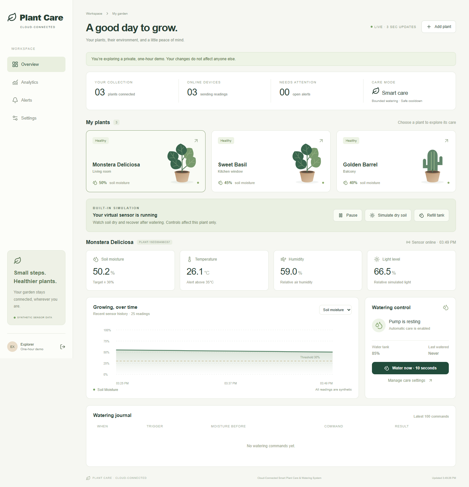
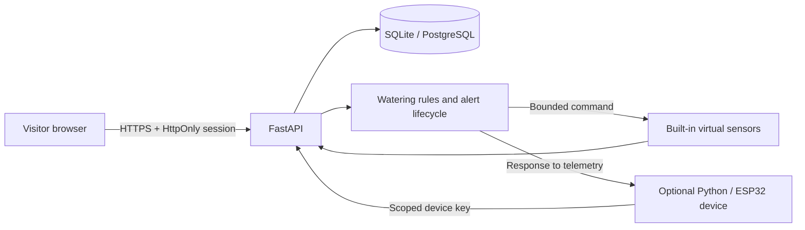

# Cloud-Connected Smart Plant Care & Watering System

**Monitor a private garden, explore virtual sensor data and automate watering from a browser.** This full-stack application connects a React dashboard to a FastAPI service with persistent history and bounded watering rules.

[](https://github.com/Subhamrbj/Cloud-Computing-Projects/actions/workflows/plant-care.yml)

[Quick start](#quick-local-start) · [Engineering walkthrough](docs/ENGINEERING_WALKTHROUGH.md) · [Architecture](docs/ARCHITECTURE.md) · [API](docs/API.md) · [Test evidence](reports/TEST_RESULTS.md)



**Status:** locally verified; cloud deployment pending. The recorded release passed **52 automated tests** and browser checks. The screenshot shows synthetic data from the running local application. [Deploy with Render and PostgreSQL](docs/DEPLOYMENT.md).

## Try the experience

- **Try interactive demo:** creates a private, temporary garden with three virtual plants. No signup required. Demo access expires after one hour.
- **Create an account:** keeps your own garden and settings in the database. Save the recovery code displayed once after registration.
- **Watch the simulation:** readings update automatically while your garden is open. No separate Python process is needed.
- **Simulate dry soil:** observe a real backend watering decision, pump activation, increasing moisture and a recorded event. Cooldown and tank safeguards still apply.
- **Explore:** switch plants, view charts, acknowledge alerts, change thresholds, pause sensors or refill the virtual tank.

All readings are synthetic. Watering controls actuate virtual pumps; physical hardware is optional and has not been validated.

## Features

| Area | Included |
|---|---|
| Identity | Signup, sign-in, HttpOnly session cookie, JWT API access, one-time recovery codes, account deletion |
| Visitor demo | Private, isolated one-hour sessions; no shared garden or public credentials |
| Monitoring | Soil moisture, temperature, humidity, light, tank level, online state and history |
| Automation | Plant-specific thresholds, manual watering, stop, maximum duration, cooldown and low-tank lockout |
| Simulation | Server-driven virtual sensors plus an optional standalone Python device client |
| Alerts | Low soil, high temperature, low tank, offline; acknowledgement and resolution |
| Persistence | SQLite locally; PostgreSQL in a dedicated schema for cloud deployment |
| Operations | Readiness check, database-backed request limits, retention, account/device quotas and Docker |
| Evidence | Automated tests, browser checks, real local screenshots, report and deployment walkthrough |

## Stack

React + Vite + custom CSS + SVG charts · Python FastAPI + SQLAlchemy · PostgreSQL / SQLite · JWT + scrypt password hashing · Docker · GitHub Actions.

The system uses **rule-based automation**, not a trained AI model. No measured water-saving or production-scale performance claim is made.

## Quick local start

Install Python 3.12+ and Node 22+. The complete ZIP includes the compiled frontend; Node is needed only to rebuild it. First-time Python dependency installation requires internet.

### Windows

Run `Start-Windows.ps1`, or use these commands from this folder:

```powershell
py -3 -m venv .venv
.\.venv\Scripts\python.exe -m pip install -r requirements.txt
.\.venv\Scripts\python.exe -m scripts.bootstrap
# Build only when frontend/dist is absent (the GitHub package contains source):
cd frontend
npm ci
npm run build
cd ..
.\.venv\Scripts\python.exe -m uvicorn backend.app:app --host 127.0.0.1 --port 8000
```

### macOS / Linux

```bash
python3 -m venv .venv
.venv/bin/python -m pip install -r requirements.txt
.venv/bin/python -m scripts.bootstrap
(cd frontend && npm ci && npm run build)
.venv/bin/python -m uvicorn backend.app:app --host 127.0.0.1 --port 8000
```

Open **http://127.0.0.1:8000** and choose **Try interactive demo** or **Create an account**. No preset login is necessary.

## Publish for other people

Recommended beginner setup: **Render Docker web service + Supabase PostgreSQL**. Render serves React and FastAPI together on one HTTPS address, so there is no second frontend deployment or CORS setup. The PostgreSQL database keeps accounts and garden records when the web service restarts.

Follow [DEPLOYMENT.md](docs/DEPLOYMENT.md). `render.yaml` and `railway.json` are supplied. Public signup initializes each visitor's garden, so you do not run a seeding command against the cloud database.

Cloud publication requires your own hosting accounts. Free services can sleep or change their limits; use the provider's current plan details. Do not describe the app as “live” until your real HTTPS URL works in a private browser window.

## Configuration

| Variable | Local / production behavior |
|---|---|
| JWT_SECRET | Random 32+ character signing secret; local bootstrap generates it |
| DATABASE_URL | Local SQLite URL or hosted PostgreSQL URL; credentials remain server-side |
| DATABASE_SCHEMA | PostgreSQL schema, defaults to `plantcare`; ignored by SQLite |
| APP_ENV | `development` locally; **`production` in cloud** enables secure cookies and forbids SQLite |
| ALLOW_REGISTRATION | `true` by default; `false` pauses new registered accounts |
| MAX_PUBLIC_USERS | Registration ceiling, default 500 total current accounts |
| PUBLIC_URL | Optional exact HTTPS origin if your proxy needs an origin-validation override |
| PORT | Supplied by the hosting platform |

Never upload `.env`, generated credentials, database files or recovery codes.

## Architecture



Registered users own their devices. Readings, watering events and alerts are scoped to those devices. Server-driven simulation uses the same decision engine as authenticated sensor ingestion. See [architecture](docs/ARCHITECTURE.md), [API reference](docs/API.md) and [security](docs/SECURITY.md).

## Watering safeguards

Defaults: indoor 30%, herb 35%, tomato 40%, succulent 20%. The target is threshold + 15 percentage points. Manual and automatic starts require fresh telemetry, tank >15%, no active command and a 60-second cooldown. Commands last at most 15 seconds. These are demonstration thresholds, not universal horticultural recommendations.

Built-in sensors stop advancing five minutes after the last dashboard visit to conserve hosting resources. Pausing a sensor also stops its active virtual command. A free sleeping host cannot supply continuous unattended irrigation monitoring.

## Data retention and privacy

Registered accounts remain until deletion. Raw readings retain seven days of history (plus the latest sample); completed watering and resolved alerts retain 90 days. Expired guest gardens are removed by periodic cleanup. Emails are identifiers and are **not verified**; no email service or advertising tracker is included. The app offers account deletion and recovery-code-based password reset. See the in-app privacy notice.

## Optional external sensors

Add a plant with **External Python sensor / ESP32** mode. Save its one-time device key. Run:

```bash
python -m sensor_simulator.simulator --url http://127.0.0.1:8000 --device YOUR_DEVICE_ID --key YOUR_DEVICE_KEY --accelerated
```

Use your HTTPS app URL in the cloud. Keep keys out of shared terminal screenshots and shell history where possible. Offline generation: `python -m sensor_simulator.simulator --offline --steps 5`. [Optional ESP32 guide](docs/HARDWARE.md).

## Testing

```bash
python -m pytest -q -p no:cacheprovider
cd frontend
npm ci
npm run build
```

The local release test run passes **52 automated tests**, plus browser checks for the visitor flows. Remote PostgreSQL, container execution and hosted deployment are not claimed as verified in this package. [Full results](reports/TEST_RESULTS.md).

## Repository layout

`backend/`: API, models, schemas, account/simulation services · `cloud/`: authentication and database · `automation/`: plant profiles and watering rules · `frontend/`: React source · `sensor_simulator/`: external virtual client · `hardware/`: optional firmware · `scripts/`: bootstrap and verification · `tests/`: regression suite · `docs/`: publishing and technical guides · `reports/`: report and evidence · `screenshots/`: real captures.

## Portfolio material

[GitHub upload instructions](docs/PORTFOLIO.md) · [LinkedIn post](docs/LINKEDIN_POST.md) · [Project report](reports/PROJECT_REPORT.md) · [Interview questions](docs/INTERVIEW.md).

This project runs independently inside the collection or as a standalone repository.

