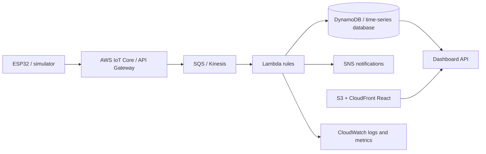

# Architecture and cloud concepts

## Simple explanation

A virtual plant dries gradually. Its software sensor sends readings to an API. The API stores each reading and compares moisture with that plant's rule. If the plant needs water and all safeguards pass, it returns a short-lived pump command. The simulator responds by increasing moisture. A browser reads the same database through authenticated endpoints, so the user can see what happened and intervene.

## Technical explanation

React is compiled into static assets served by FastAPI. The sensor simulator has a separate credential for each device and uses JSON over HTTP locally or HTTPS when hosted. FastAPI validates typed payloads, locks the relevant device, writes the reading, reconciles alerts and computes a command in a transaction. SQLAlchemy targets SQLite for local use or PostgreSQL for persistent cloud storage. User requests are scoped by the JWT subject and the device owner. The dashboard polls every three seconds. A five-second watchdog handles expired commands and stale heartbeats while the API process is awake.

The database stores requested pump state as an absolute expiry, avoiding a new watering window on every sensor retry. Sensors stop locally on communication failure. A device that reconnects does not replay old queued commands. The event journal records decisions, not independently verified physical actuation.

## Three implementation options

| Option | Architecture and purpose | Difficulty | Cost and hardware | Expected output |
|---|---|---|---|---|
| A Local beginner | Simulator → FastAPI → SQLite → HTML/JS or React | Low–medium | Local compute; no hardware | Full single-laptop demo; basic API/storage concepts |
| B Recommended | Simulator → HTTPS FastAPI → hosted PostgreSQL → React | Medium | Provider free tiers may suffice for demos; no hardware | Persistent cloud data, remote dashboard, hosted identity enforcement |
| C Advanced | ESP32 → MQTT IoT broker → queue/functions → managed/time-series DB → React | High | Hardware, broker, database and message costs vary | Device fleet, event-driven scale and actual irrigation after validation |

This package implements B's application with A's local fallback. C is an architectural extension plus an optional HTTPS ESP32 sketch. MQTT, managed identity and serverless event services are not running components of the local build.

## Data model

| Entity | Primary fields | Relations / indexes |
|---|---|---|
| users | user_id, name, email, password_hash, created_at | Unique email; owns devices |
| devices | device_id, user_id, plant_name, plant_type, location, moisture_threshold, auto_water, key_hash, last_seen, last_watered, pump_until | Owner index; FK to users |
| sensor_readings | reading_id, device_id, sample_id, soil_moisture, temperature, humidity, light_level, water_tank_level, timestamp, received_at | FK to device; unique device/sample; device/time index |
| watering_events | event_id, device_id, trigger_type, moisture_before, moisture_after, duration, timestamp, stopped_at, stop_reason | Device index; records each accepted command |
| alerts | alert_id, device_id, alert_type, level, message, status, created_at, resolved_at | Device index; open → acknowledged → resolved |

Timestamps in API results/database are Unix UTC seconds; sensor input accepts ISO 8601 with timezone. Server receipt time is used for heartbeat freshness. Optional device sensor time is not trusted as proof of connectivity. Sensor time must be within five minutes and later than the previous stored measurement. The public API does not expose direct database access.

## Where each cloud concept appears

| Concept | Concrete place or scope |
|---|---|
| Cloud computing | Application can be hosted remotely with managed persistence |
| IoT-to-cloud | Independently credentialed sensors send HTTPS JSON |
| SaaS | Browser-based plant care is the user-facing software service |
| PaaS | Render manages application runtime; Supabase manages PostgreSQL |
| IaaS | Not used directly; equivalent VM deployment could run Docker |
| Cloud database | DATABASE_URL connects the same models to hosted PostgreSQL |
| Time-series data | Timestamped readings, device/time index and history API |
| REST APIs | Typed resources exposed by FastAPI/OpenAPI |
| MQTT | Advanced design uses publish/subscribe; not implemented here |
| Serverless computing | Proposed AWS Lambda ingestion, not the current container |
| Cloud Functions | Azure Functions/GCP Cloud Run functions can replace ingestion handlers |
| Event-driven architecture | Current ingestion triggers rules synchronously; queue/event bus is a future split |
| Scalability | Per-device processing, bounded history queries and indexed storage |
| Elasticity | PaaS capacity changes; full multi-instance automation needs shared scheduling |
| Availability | Health endpoint and managed hosting; no measured availability SLA |
| Authentication | Password login/JWT for people; device keys for sensors |
| Authorization | SQL queries restrict device and alert access by owner |
| API Gateway | Future fleet ingress for shared rate limiting and identity enforcement |
| Load balancing | Hosting ingress routes HTTPS; multi-process deployment requires reviewing state/locks |
| Environment variables | Database URL, signing key, sensor interval and API URL |
| Secrets management | Local ignored .env; provider secret configuration in cloud |
| Logging | API logs, simulator retry/state logs; no credential bodies |
| Monitoring | Health endpoint, heartbeat ages, online state and event history |
| Alerts | Persisted condition lifecycle and dashboard acknowledgement |
| Cloud deployment | Dockerfile, Render blueprint and explicit provisioning guide |
| CI/CD | GitHub Actions verifies tests/build; Render can redeploy on commits |

## Scaling honestly

**10 plants:** one API process and SQLite suffice for a local demo. Cloud use should put PostgreSQL on persistent managed storage. SQLite writes are serialized inside the process.

**1,000 plants:** use PostgreSQL, stagger transmission intervals, add gateway limits, connection pooling, batched reads and database retention. At one sample per minute, 1,000 devices produce roughly 1.44 million rows/day. Current rate limiting is per-IP/per-process and must be replaced for real fleets sharing network addresses.

**100,000 plants:** separate MQTT/HTTPS ingress from automation with a durable queue. Partition by device identity, maintain idempotency, shard/partition time-series storage, autoscale stateless consumers and use a distributed scheduler. Avoid running a full-table heartbeat scan in every web process. Add dead-letter handling and command acknowledgement state.

**1,000,000 readings:** indexes keep device-window queries useful, but storage and retention still matter. Partition by time, aggregate hourly/daily summaries, archive raw records to object storage and implement expiry policies. This package intentionally does not silently delete history.

If thousands arrive simultaneously, gateway throttling and buffering should absorb bursts. Backoff and jitter reduce retry synchronization; the current simulator has bounded exponential backoff but no durable queue. Benchmark before making any throughput claim. Neither million-row nor 100,000-device capacity has been load-tested in this package.

## Enterprise mapping

Azure mapping: IoT Hub, Event Hubs/Service Bus, Functions, Cosmos DB or managed PostgreSQL, Blob Storage, Azure Monitor and Notification Hubs. GCP mapping: HTTPS device gateway or partner MQTT broker, Pub/Sub, Cloud Run/functions, Firestore or Cloud SQL, Cloud Storage, Cloud Monitoring and FCM. Do not use the retired GCP Cloud IoT Core service as a new deployment target.

## Industry relevance

Smart agriculture and precision farming vary irrigation by location and soil conditions. Greenhouses and nurseries monitor many zones centrally. Smart homes expose simple remote controls. Vertical farms and hydroponics add nutrient, pH and electrical-conductivity measurements. Commercial landscaping coordinates distributed assets; environmental monitoring emphasizes telemetry reliability even without an actuator. Verdant demonstrates the shared architecture; these industries require additional calibration, reliability engineering and domain validation.

Potential business value includes fewer unnecessary watering actions, earlier alerts, historical diagnosis and centralized management. No measured water-saving percentage, crop-yield improvement or commercial ROI is claimed.
