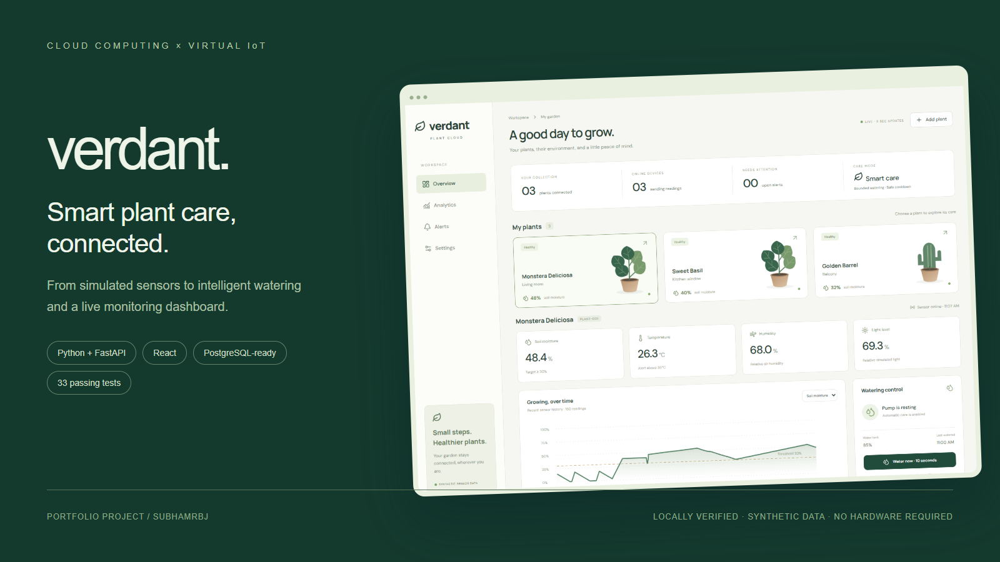
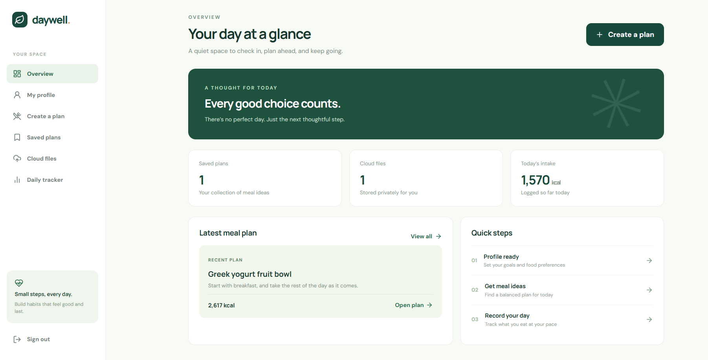

# Cloud Computing Projects

**Full-stack applications exploring cloud persistence, authentication and automated workflows.**

Working application code, architecture notes, automated checks and screenshots. Each project documents its local setup, cloud configuration and verification limits.

## Explore the projects

| Project | Experience | Engineering focus |
|---|---|---|
| [05 · Smart Plant Care & Watering](05_Cloud_Connected_Smart_Plant_Care/README.md) | Private gardens, virtual sensors, automatic watering, charts and alerts | Account isolation, device identity, bounded commands and persistent telemetry |
| [01 · Personal Diet Planner](01_Personal_Diet_Planner/README.md) | Profile-based meal plans, private files and daily intake tracking | Authenticated APIs, database and storage adapters, optional AI fallback |

Project numbers follow the course sequence.

## Smart Plant Care & Watering

Visitors can explore a private one-hour demo or register for a persistent garden. Virtual sensors feed a FastAPI service that stores readings, evaluates watering rules and returns live state to a React dashboard. No physical sensors are needed for the local experience.

**Stack:** React · Vite · FastAPI · SQLAlchemy · SQLite / PostgreSQL · Docker

- JWT sessions in HttpOnly cookies, scrypt password hashing, recovery codes and account deletion.
- Fresh-reading checks, low-tank lockout, a 60-second cooldown and a 15-second command limit.
- 52 passing tests in the recorded local release, plus browser checks for signup, recovery and watering. The badge above links to current remote checks.
- A single cloud web service serves the frontend and API, with PostgreSQL for persistent data.

[Setup](05_Cloud_Connected_Smart_Plant_Care/README.md#quick-local-start) · [Engineering walkthrough](05_Cloud_Connected_Smart_Plant_Care/docs/ENGINEERING_WALKTHROUGH.md) · [Test evidence](05_Cloud_Connected_Smart_Plant_Care/reports/TEST_RESULTS.md) · [Deployment](05_Cloud_Connected_Smart_Plant_Care/docs/DEPLOYMENT.md)

**Live demo status:** deployment pending. Screenshots show the local application with synthetic readings.

## Personal Diet Planner

An account-based application with a rule-based recipe catalog, saved plans, private file uploads and daily intake tracking. PostgreSQL, S3-compatible storage and an AI endpoint are optional configurations.

**Stack:** React · Vite · FastAPI · SQLAlchemy · JWT · Docker Compose

[Setup and features](01_Personal_Diet_Planner/README.md) · [Backend tests](01_Personal_Diet_Planner/backend/tests/) · [Cloud concepts](01_Personal_Diet_Planner/docs/02_cloud_concepts.md) · [Deployment](01_Personal_Diet_Planner/docs/08_local_and_cloud_deployment.md)

## Review the implementation

| Area | Source |
|---|---|
| API design and access control | [Plant API](05_Cloud_Connected_Smart_Plant_Care/backend/app.py), [authentication](05_Cloud_Connected_Smart_Plant_Care/cloud/auth_service.py) |
| Automation and failure handling | [Watering rules](05_Cloud_Connected_Smart_Plant_Care/automation/watering_engine.py), [command lifecycle](05_Cloud_Connected_Smart_Plant_Care/backend/services.py) |
| Data modeling | [Plant models](05_Cloud_Connected_Smart_Plant_Care/backend/models.py), [diet models](01_Personal_Diet_Planner/backend/app/models.py) |
| Verification | [Plant tests](05_Cloud_Connected_Smart_Plant_Care/tests/), [CI workflows](.github/workflows/) |

## Run locally

Clone the repository and follow the README in the selected project folder. These are independent applications; run them separately because their default API ports overlap. The CI configuration uses Python 3.12 and Node.js 22.

These educational implementations include deployment configuration. Hosted operation, physical irrigation and production-scale performance require separate validation. Project READMEs explain the specific boundaries.
